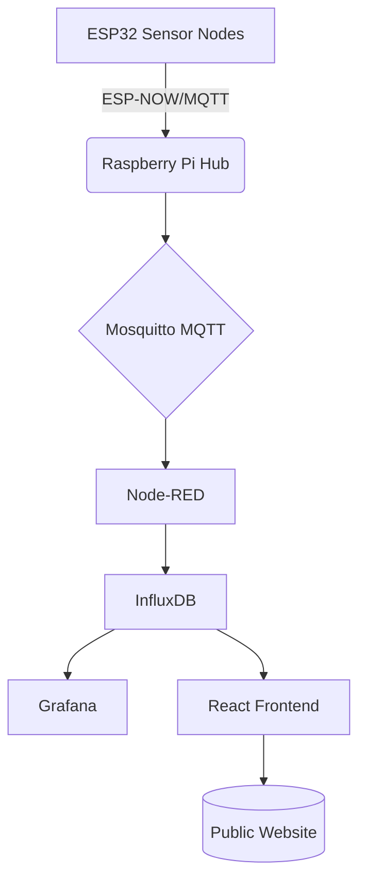

# 🌱 IoT Garden Monitoring System
[](https://opensource.org/licenses/MIT)
[](https://github.com/INIT-BUILD-IoT-Garden)

A cost-effective, scalable IoT solution for real-time environmental monitoring in Florida International University's GCI Butterfly Garden. This system combines ESP32 sensor nodes with a centralized Raspberry Pi hub and modern web visualization tools.

## 🚀 Key Features
- **Real-time sensor monitoring** (soil moisture, temperature, humidity, light levels)
- **Distributed ESP32 architecture** with ESP-NOW protocol for efficient communication
- **Centralized data pipeline** using:
  - **Mosquitto MQTT** broker for message queuing
  - **Node-RED** for workflow automation
  - **InfluxDB** for time-series data storage
  - **Grafana** for internal analytics dashboards
- **Public-facing visualization portal** with:
  - React.js frontend
  - Tailwind CSS styling
  - Interactive charts using React Graphs
  - 3D team visualization with Three.js

## 🛠️ System Architecture


## ⚙️ Installation

### Hardware Requirements
- ESP32 development boards
- Sensors: soil moisture, DHT22, light sensors
- Raspberry Pi 4+ (4GB RAM recommended)

### Software Setup
```bash
# Raspberry Pi Base System
docker-compose up -d \
  mosquitto \
  node-red \
  influxdb \
  grafana
```


**ESP32 Firmware** (PlatformIO):
```cpp
#include <WiFi.h>
#include <ESPmDNS.h>
#include <ArduinoMqttClient.h>

void setup() {
  Serial.begin(115200);
  initSensors();
  connectToMQTT("broker.local", 1883);
}
```


## 📊 Data Flow
1. Sensors collect environmental data every 5 minutes
2. ESP32 nodes transmit via ESP-NOW to hub
3. MQTT broker queues messages for processing
4. Node-RED transforms and stores data in InfluxDB
5. Grafana queries database for internal dashboards
6. React frontend displays public visualization

## 🌍 Public Visualization
```jsx
// Example React component using ApexCharts
import Chart from 'react-apexcharts';

<Chart 
  options={chartOptions} 
  series={sensorData} 
  type="line" 
  width="100%"
/>
```


## 🤝 Contributing
1. Fork the repository
2. Create feature branch (`git checkout -b feature/improvement`)
3. Commit changes (`git commit -m 'Add amazing feature'`)
4. Push to branch (`git push origin feature/improvement`)
5. Open Pull Request

## 📄 License
MIT License - See [LICENSE](LICENSE) for details
